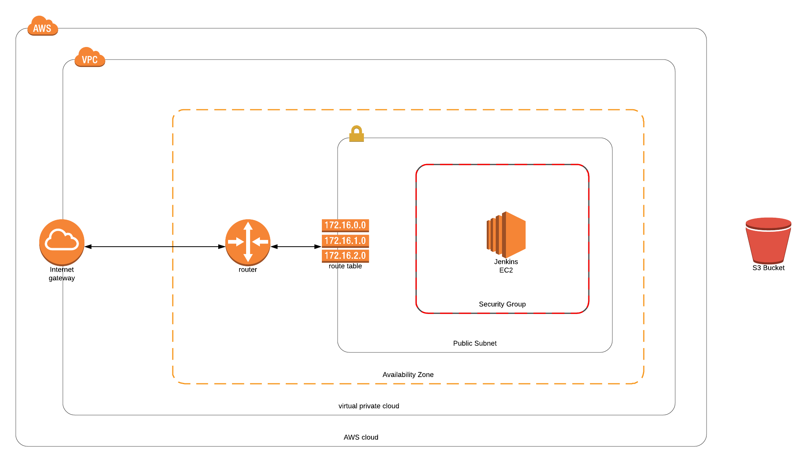

# About the project

This project is part of the Udacity Nanodegree Program "Cloud DevOps Engineer". The objective is going to deploy an API using blue-green strategy directly on Kubernetes.

This repository contains all code required to deploy stacks and provision Jenkins, which will help you to execute CI/CD of the [Capstone API](https://github.com/davidasrocha/capstone-api-grandmother-recipes), [Kubernetes Cluster](https://github.com/davidasrocha/capstone-kubernetes-setup) and to deploy this API over the Kubernetes.



### How to run and configure project

First, you need to have configured **[AWS CLI](https://aws.amazon.com/cli/)** in your computer.

Second, you need to have a KeyPair for your Jenkins EC2 instance, and configured it in your computer.

Then, you are going to [configure stacks](./cloudformation/README.md) and [provisioner Jenkins server](./ansible/README.md).

### Configure Jenkins Pipeline

Finally, you need to install some Jenkins Plugins ([Blue Ocean](https://jenkins.io/projects/blueocean/) and [AWS Pipeline](https://github.com/jenkinsci/pipeline-aws-plugin)), and configure AWS credentials for it.

### How to setup Jenkins

You can do a setup including CloudFormation Stacks and Jenkins install and follow the Jenkins Wizard Configuration.

First, you need to run this command:

```
./jenkins-setup.sh STACK_NAME VPC_CIDR_BLOCK SUBNET_CIDR_BLOCK YOUR_IP_ADDRESS KEYPAIR_NAME
```

After this command running you can get **Jenkins URL** in console to access **Jenkins Wizard** in Web Browser.