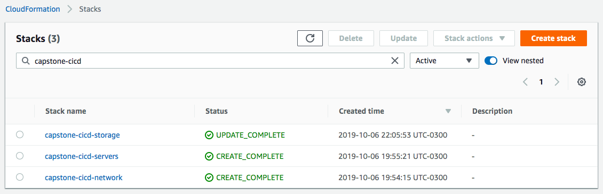

# How to run and configure CloudFormation Stacks

First, you need set parameters to CloudFormation stack:

* Copy file `./parameters/jenkins-network.json.dist` to `./parameters/jenkins-network.json`, and edit parameters.
* Copy file `./parameters/jenkins-servers.json.dist` to `./parameters/jenkins-servers.json`, and edit parameters.

Now, you can run this command to create stacks to Jenkins network, server and S3 Bucket:

```
./jenkins-stack-create.sh YOUR_STACK_NAME
```

After executing the previous command, you will find in your AWS Console CloudFormation Stacks a similar image:



If there are already stacks, you can run this command to update these stacks:

```
./jenkins-stack-update.sh YOUR_STACK_NAME
```

Run this command to update S3 Bucket to web site:

```
./website-stack-update.sh YOUR_STACK_NAME
```

After create or update the stacks, you can use exported values:

* **JenkinsIp**: used to access Jenkins Server using SSH
* **JenkinsURL**: used to access Jenkins by web browser

### How to delete stacks

You can run these commands:

```
./jenkins-stack-delete.sh YOUR_STACK_NAME
```

Run this command to delete S3 Bucket web site:

```
./website-stack-delete.sh YOUR_STACK_NAME
```